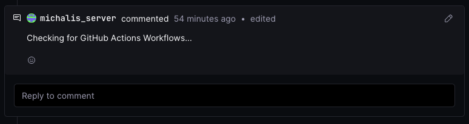
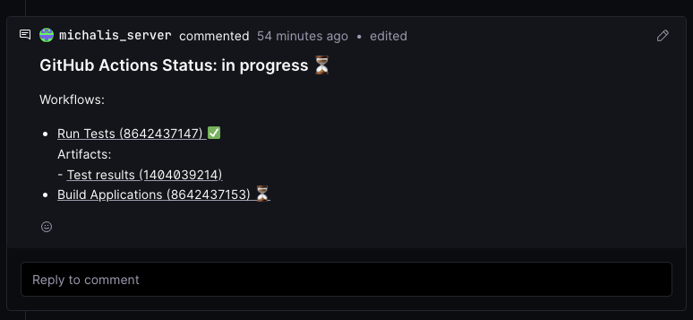

# Project setup for GitHub Actions

The goal of this document is to describe the process of creating a project/repository that will work with GitHub 
Actions. Any push to the repo should update both Radicle and GitHub for all changes. The GitHub Actions adapter 
will inform back the broker with any results and also update any patch using comments.

## Project Setup

In order to set up a project/repository to work with the Radicle GitHub Adapter we must add some metadata within the 
repo about the GitHub Repository (workspace & repo name). We must also be able to push any change to both the 
Radicle forge and the GitHub forge at the same time.

This can be done manually by following the manual steps bellow or by using the script provided with

```bash
./scripts/setup-rad-gh.sh
```

The script must be run within the repository that we want to set it up.
The repository should be already initialised as a Radicle repository for this script to work.

### Radicle settings for GitHub Actions

Repository should persist information in order to store the GitHub's username and repository that the actions will run.
These information should be stored under the `.radicle/github_actions.yaml` file within the repo's root directory.
The content of the file should be:

```yaml
github_username: user
github_repo: repo_name
```

### Repo setup

The repository/project must be setup in a way that each update on the forge should update **both** GitHub and
Radicle. This way source code will be hosted in Radicle's network but also GitHub Actions will run within the GitHub.

Radicle GitHub Actions adapter will inform the Radicle project for any GitHub Actions' status through the Radicle Ci 
Broker.

The process for adding both push servers is to update `git remotes`.  This can be done using the following commands 
within the project's root directory:

```bash
git remote add both rad://REPO_ID
git remote set-url --push both < https://github.com/user/repo.git > OR git remote set-url --add --push both < git@github.com:user/repo.git >
git remote set-url --add --push both rad://REPO_ID/NODE_ID
```

Where:
* RAD_ID: the rad id of the project (e.g. `z3VYhzZ9Vw4nqceS7Ns5vQbo3mctL`)
* NODE_ID: the ID of the current running node (e.g. `z6MkkpTPzcq1ybmjQyQpyre15JUeMvZY6toxoZVpLZ8YarsB`)
* https://github.com/user/repo.git OR git@github.com:user/repo.git: the git repo URL

This will end up to this output of the `git remote -v` command:

```
» git remote -v
both	rad://z3VYhzZ9Vw4nqceS7Ns5vQbo3mctL (fetch)
both	rad://z3VYhzZ9Vw4nqceS7Ns5vQbo3mctL/z6MkkpTPzcq1ybmjQyQpyre15JUeMvZY6toxoZVpLZ8YarsB (push)
both	https://github.com/user/repo.git (push)
origin	https://github.com/user/repo.git (fetch)
origin	https://github.com/user/repo.git (push)
rad	rad://z3VYhzZ9Vw4nqceS7Ns5vQbo3mctL (fetch)
rad	rad://z3VYhzZ9Vw4nqceS7Ns5vQbo3mctL/z6MkkpTPzcq1ybmjQyQpyre15JUeMvZY6toxoZVpLZ8YarsB (push)
```

If the project hs started as a radicle project and then added github remotes it will end up to this output of the `git 
remote -v` command:

```
» git remote -v
both	rad://z2z4TxRWgHjKZzBjjAPceX59A7aC5 (fetch)
both	rad://z2z4TxRWgHjKZzBjjAPceX59A7aC5/z6MkkpTPzcq1ybmjQyQpyre15JUeMvZY6toxoZVpLZ8YarsB (push)
both	https://github.com/user/repo.git (push)
rad	rad://z2z4TxRWgHjKZzBjjAPceX59A7aC5 (fetch)
rad	rad://z2z4TxRWgHjKZzBjjAPceX59A7aC5/z6MkkpTPzcq1ybmjQyQpyre15JUeMvZY6toxoZVpLZ8YarsB (push)
```

Now every push should be done to using `both` remote. So pushing a commit should be invoked as

```bash
git push both main
```

### Opening a patch

In order to open a patch to radicle and get the results from the GitHub Actions workflows the refs must be pushed to 
both forges. In order to do that follow these steps:

* Checkout to a new branch:

```bash
git checkout -b new-feature-x
```

* Do your changes and commit them

```bash
git add .
git commit -m 'Implemented feature X'
```

* Push to both remotes

```bash
git push both new-feature-x
```

* Open the path at Radicle and wait for the workflows' results to appear

```bash
git push rad -o patch.message="Implemented feature X" HEAD:refs/patches
```

If everything is set up correctly, a comment will ba added to the patch providing information for the progress and the 
results of the GitHub Actions workflows. The comment will be updated periodically with update information.

  
  
  
